``
# 🔐 API Security Lab

## 👤 Author

**Louis Okperiruisi**  
Cybersecurity Analyst | SOC | API Security | AI Security

---

## 📌 Overview

This project demonstrates practical API security assessment using industry-standard tools to identify, analyze, and remediate vulnerabilities in real-world API environments.

The assessment was conducted using:
- **Qualys TotalAppSec**
- **Aikido Security Platform**
- **Wallarm API Security**

Target APIs were sourced from:  
[API Security University Tools & Resources](https://www.apisecuniversity.com/api-tools-and-resources)

---

## 🎯 Objectives

- Perform API vulnerability scanning
- Identify security weaknesses
- Analyze risks and impacts
- Recommend remediation strategies
- Improve API security posture

---

## 🛠️ Tools Used

- **Qualys** – Web and API vulnerability scanning
- **Aikido** – API security monitoring and issue analysis
- **Wallarm** – API threat detection and vulnerability analysis
- **Postman Collections** – API testing and target setup

---

## 🔍 Key Findings

### 1. Inconsistent Security Controls (User-Agent Manipulation)
- Different responses were observed based on user-agent behavior
- Potential exposure to:
  - Cross-Site Scripting (XSS)
  - SQL Injection
  - Authorization bypass

**Recommendation**
- Enforce consistent validation and security controls across all user-agents
- Apply strict input validation and output sanitization

### 2. TLS Renegotiation Vulnerability
- Potential man-in-the-middle (MITM) attack vector
- Weak TLS session handling identified

**Recommendation**
- Enable TLS secure renegotiation
- Enforce TLS 1.2 / TLS 1.3 only

### 3. Missing Rate-Limiting Headers
- No `X-RateLimit-*` headers found
- Risk of API abuse and denial-of-service behavior

**Impact**
- Poor API usage control
- Higher risk of HTTP 429-related failures
- Weak visibility for clients consuming the API

**Recommendation**
- Implement rate limiting using:
  - API Gateway such as NGINX, Kong, or AWS API Gateway
  - Middleware such as FastAPI + slowapi
- Add standard headers:
  - `X-RateLimit-Limit`
  - `X-RateLimit-Remaining`
  - `X-RateLimit-Reset`

### 4. Security Misconfiguration (Wallarm Findings)
- Improper configuration exposed internal resources
- Sensitive components and interfaces were accessible

**Recommendation**
- Secure deployment configurations
- Restrict unnecessary endpoints and exposed services
- Apply proper access control and patch vulnerable components

---

## 📊 Tools Comparison

| Tool | Strength | Key Finding |
|------|----------|-------------|
| Qualys | Deep vulnerability scanning | TLS and endpoint inconsistencies |
| Aikido | Developer-focused issue analysis | Missing rate limits and browser security gaps |
| Wallarm | API threat detection | Security misconfiguration and vulnerable components |

---

## 📸 Evidence & Scan Results

### Aikido Security Platform

**Dashboard**  
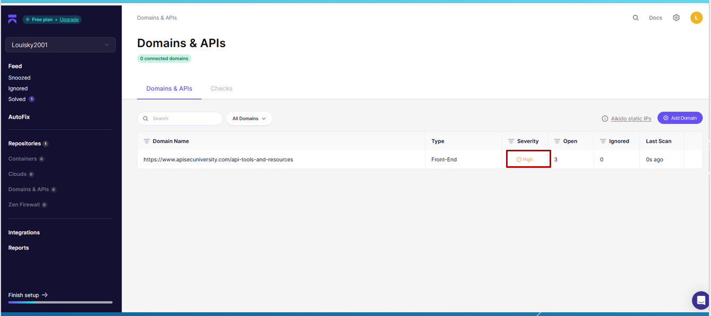

**Findings Summary**  
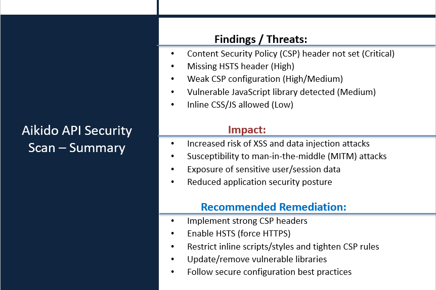

**Issue Details**  
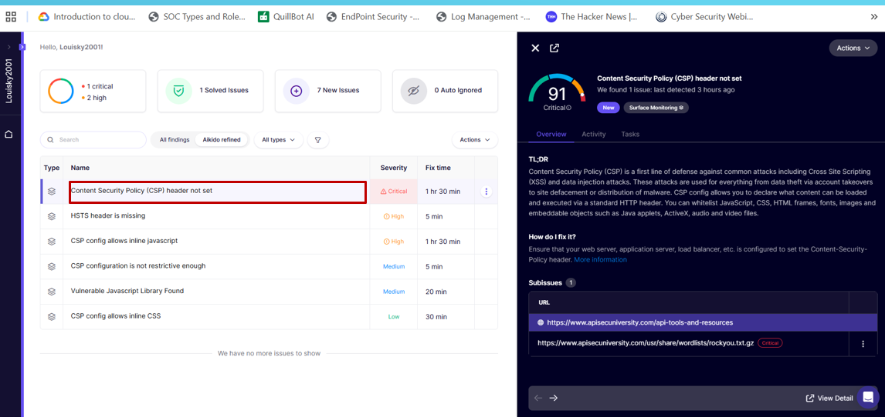

**Vulnerabilities**  
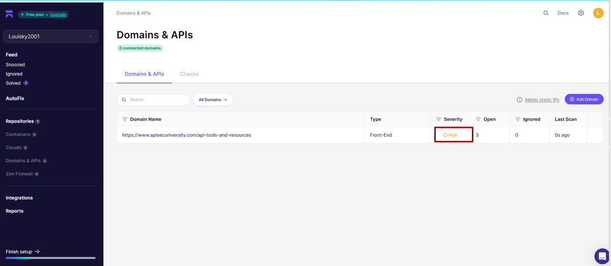

### Qualys TotalAppSec

**API Target**  
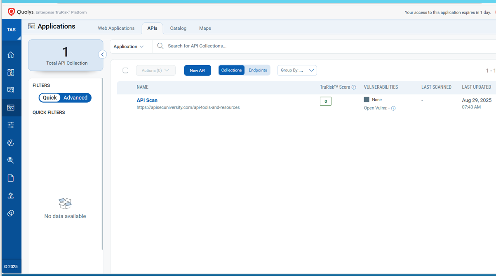

**Detections**  
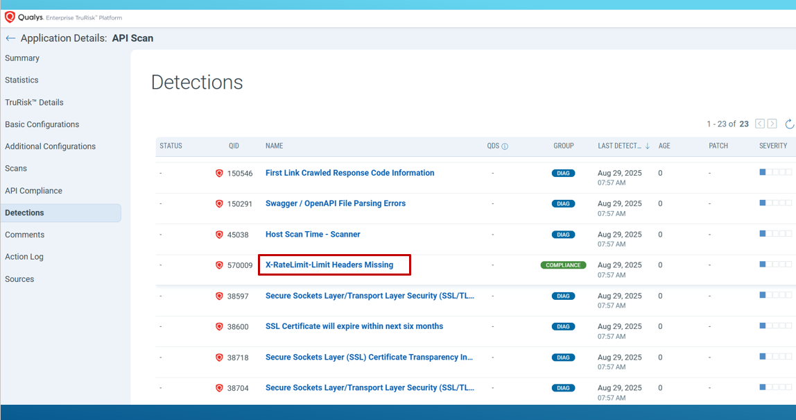

**Findings Summary**  
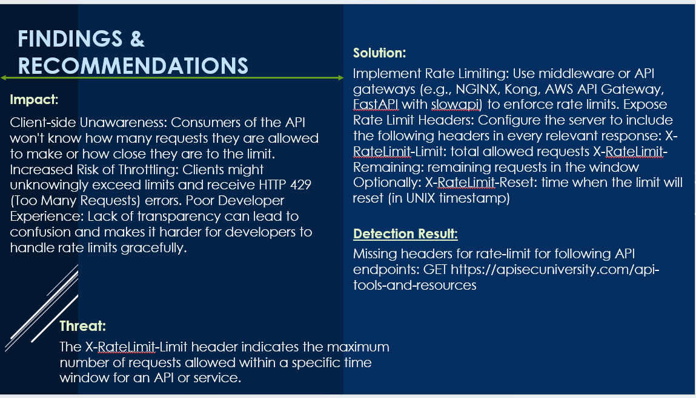

**Scan Setup**  
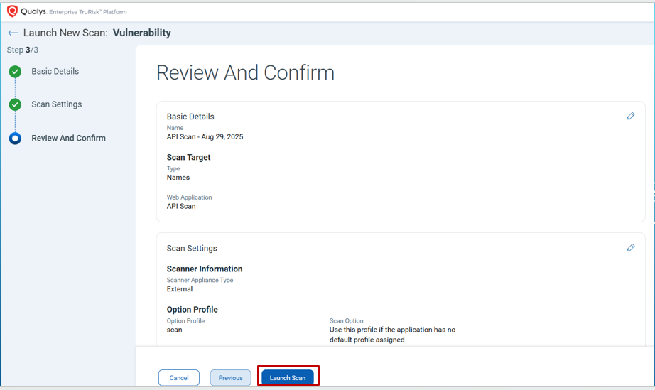

### Wallarm API Security

**Dashboard**  
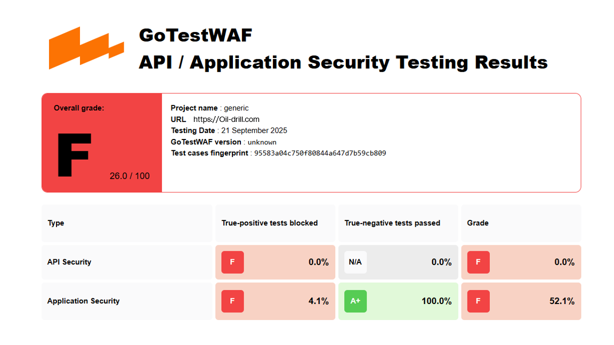

**Findings Summary**  
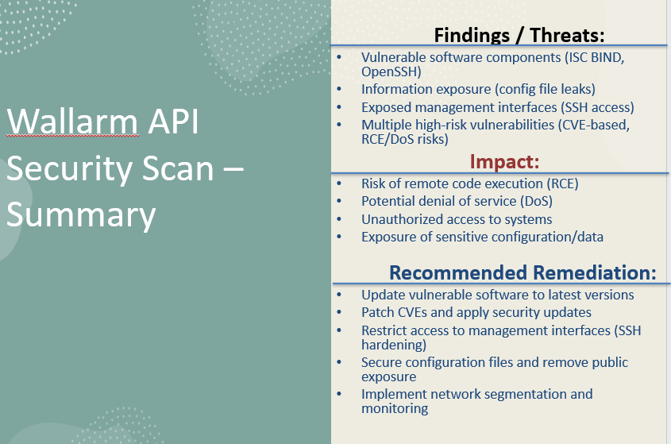

**Issue Details**  
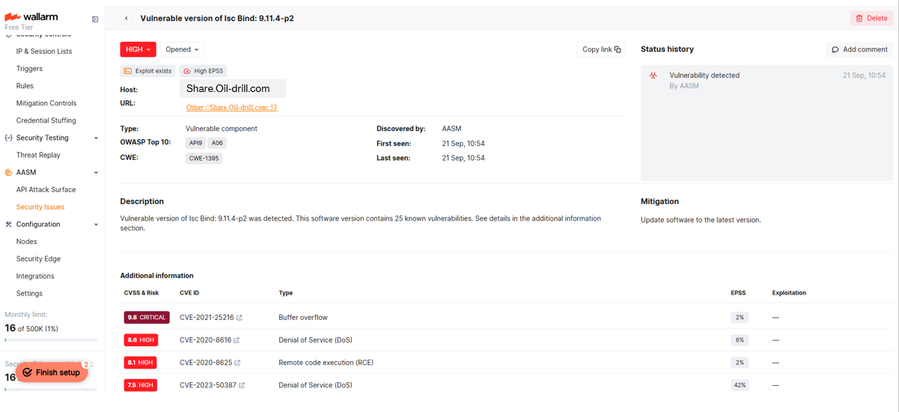

**Vulnerabilities**  
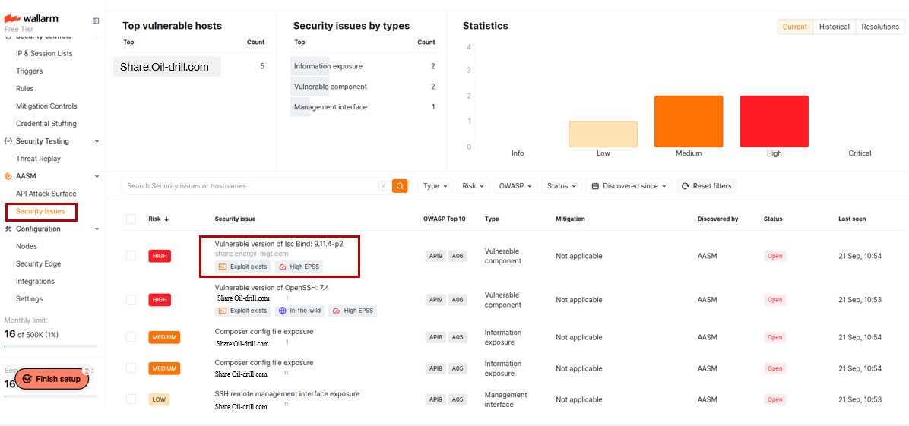

---

## 🧠 Skills Demonstrated

- API Security Testing
- Vulnerability Assessment
- Risk Analysis
- Security Tool Integration
- Findings Documentation
- Security Recommendations and Reporting

---

## 📁 Project Structure

```text
api-security-lab/
├── README.md
├── reports/
│   ├── qualys-report.md
│   ├── aikido-report.md
│   └── wallarm-report.md
├── findings/
│   └── key-findings.md
├── screenshots/
│   ├── aikido/
│   │   ├── dashboard.png
│   │   ├── findings-summary.png
│   │   ├── issue-details.png
│   │   └── vulnerabilities.png
│   ├── qualys/
│   │   ├── api-target.png
│   │   ├── detections.png
│   │   ├── findings-summary.png
│   │   └── scan-setup.png
│   └── wallarm/
│       ├── dashboard.png
│       ├── findings-summary.png
│       ├── issue-details.png
│       └── vulnerabilities.png
